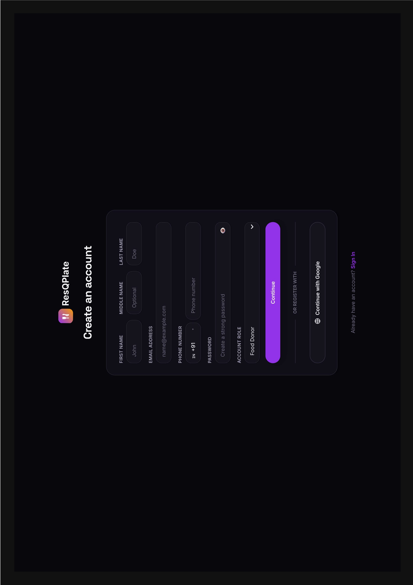
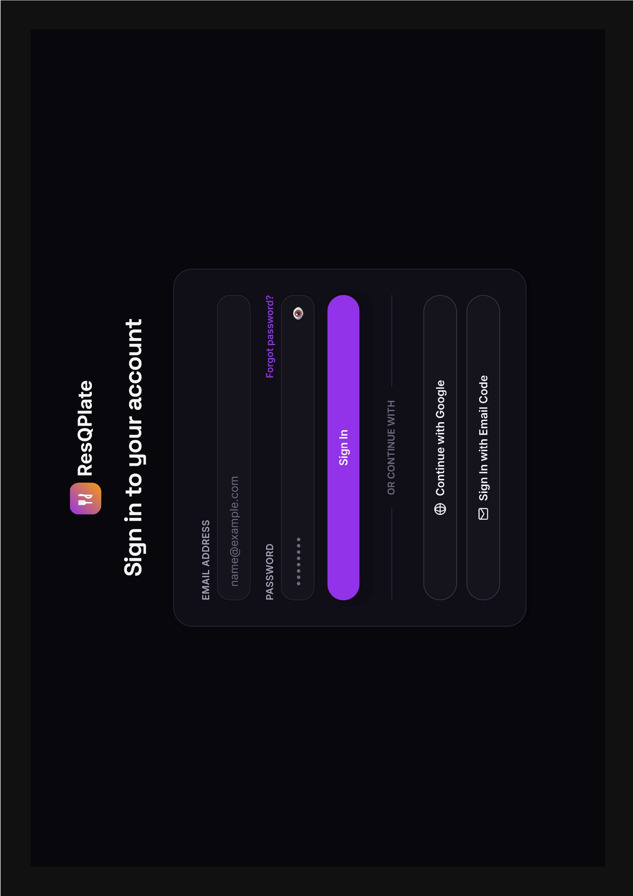
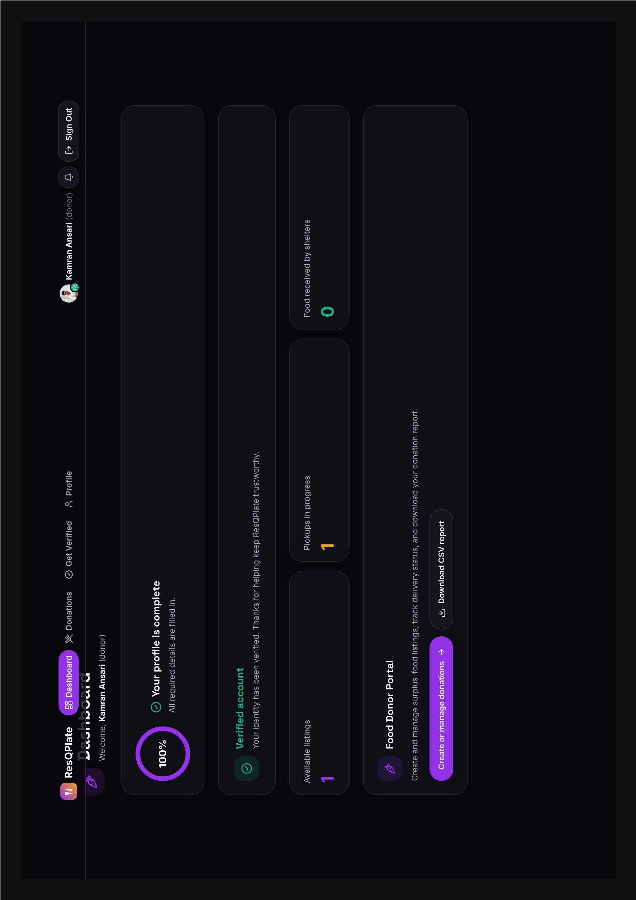
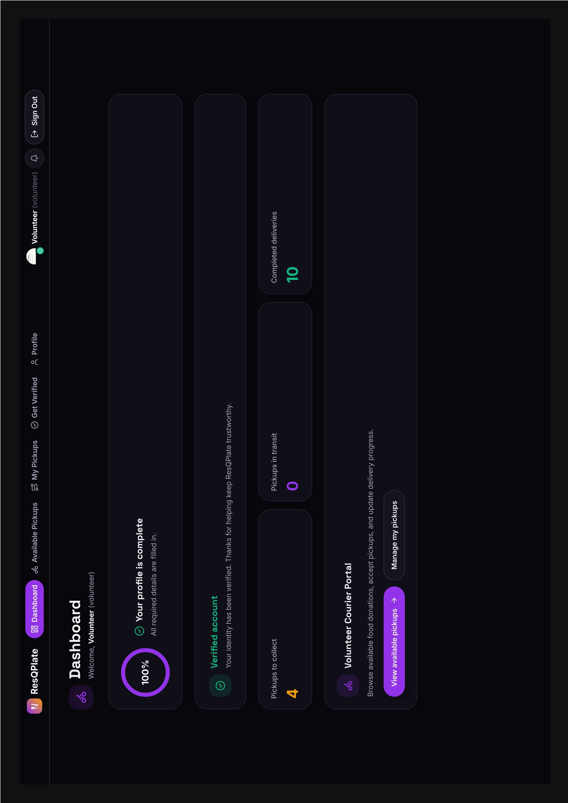
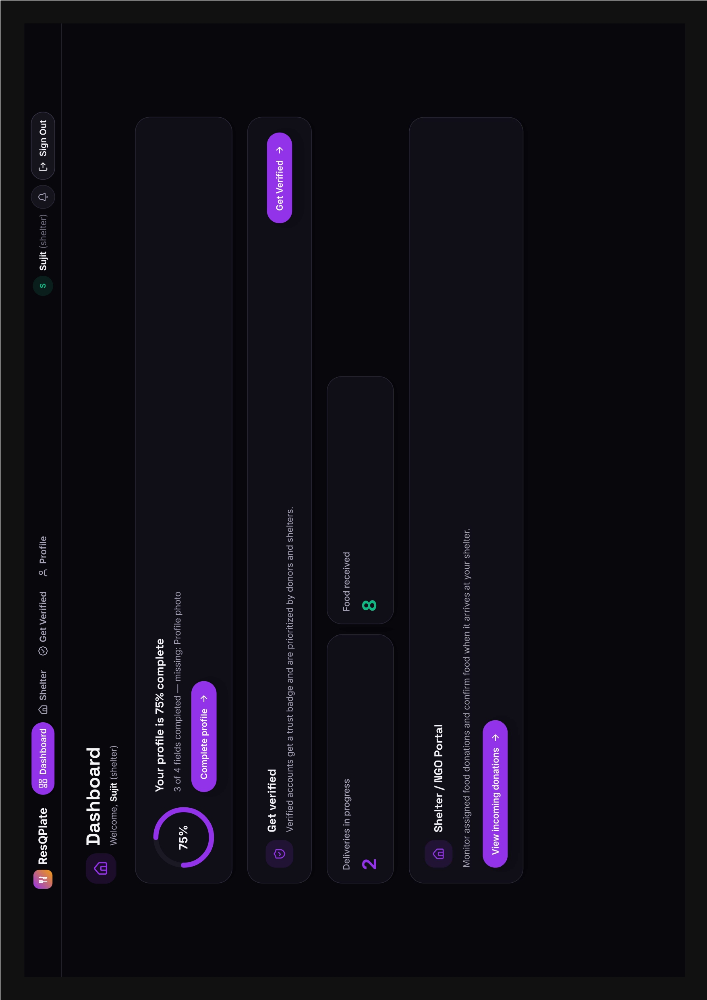

# 🍽️ ResQPlate

**Rescue food, not just feed hope.**

ResQPlate is a full-stack food-rescue platform that connects surplus-food **donors**, verified **volunteer couriers**, and **shelters/NGOs** in real time — so good food reaches people who need it before it goes to waste.

---

## 📋 Table of Contents

- [Overview](#overview)
- [Features](#features)
- [Tech Stack](#tech-stack)
- [Screenshots](#screenshots)
- [Project Structure](#project-structure)
- [Getting Started](#getting-started)
- [Environment Variables](#environment-variables)
- [Available Scripts](#available-scripts)
- [Deployment](#deployment)
- [License](#license)

---

## Overview

ResQPlate closes the loop between surplus food and the people who need it, through three connected roles:

1. **Food Donor** lists surplus food with pickup details.
2. **Volunteer** claims a nearby pickup and delivers it.
3. **Shelter / NGO** confirms receipt when the food arrives.

An **Admin** panel oversees users, donation activity, and identity verification across the platform.

---

## Features

### 🧑‍🍳 Food Donor
- Create, edit, and cancel surplus-food listings
- Track pickup and delivery status in real time
- Download a CSV report of donation history
- Profile completion & identity verification flow

### 🚴 Volunteer
- Browse available pickups near them
- Accept a pickup and update delivery progress (in transit → delivered)
- View completed delivery history
- Rate donors/shelters after a completed delivery

### 🏠 Shelter / NGO
- View incoming donations assigned to the shelter
- Confirm receipt of food when it arrives
- Track total food received over time

### 🛡️ Admin
- Platform-wide stats dashboard
- Manage users and roles
- Review and approve/reject identity verification submissions
- Oversee all donation listings

### 🔐 Authentication
- Email/password sign-up with OTP email verification
- Passwordless sign-in via one-time email code
- Google OAuth sign-in
- Forgot/reset password flow
- Role selection for new OAuth sign-ups

---

## Tech Stack

| Layer | Technology |
|---|---|
| Framework | [Next.js 16](https://nextjs.org) (App Router) |
| Language | TypeScript |
| UI | React 19, Tailwind CSS v4 |
| Database | MongoDB with Mongoose |
| Auth | NextAuth.js v5 (Credentials, Email OTP, Google) |
| Media storage | Cloudinary |
| Email | Nodemailer (Gmail) |
| Icons | Lucide React |

---

## Screenshots

| Sign Up | Sign In |
|---|---|
|  |  |

| Donor Dashboard | Volunteer Dashboard | Shelter Dashboard |
|---|---|---|
|  |  |  |

---

## Project Structure